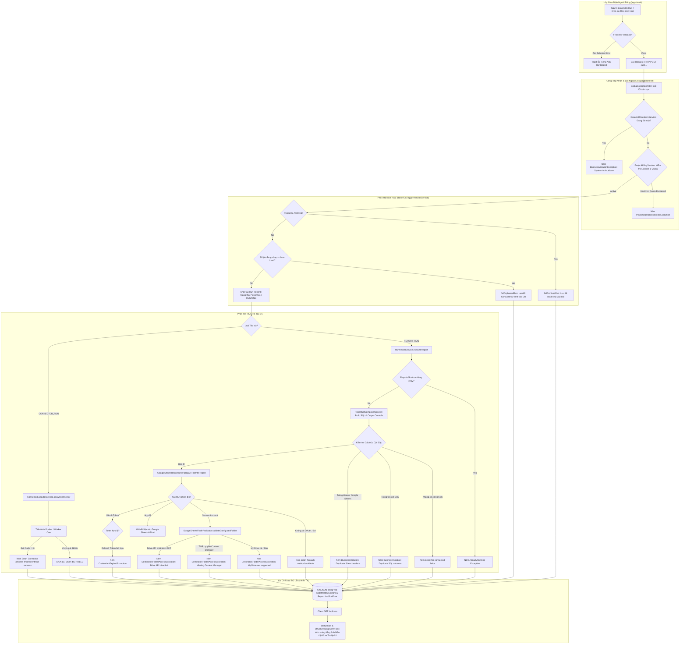

# BÁO CÁO KIỂM TOÁN KỸ THUẬT CHUYÊN SÂU TOÀN DIỆN (DEEP TECHNICAL AUDIT)
## HỆ THỐNG ĐIỂM GÃY VẬN HÀNH VÀ LỖI BẢN ĐỊA HÓA I18N
**Dự án:** `owox-data-marts` (p2pdigital-data-marts)  
**Phạm vi:** Toàn bộ mã nguồn Frontend (`apps/web`), Backend (`apps/backend`), UI Kit (`packages/ui`)  
**Phương pháp:** Kiểm toán tĩnh chuyên sâu (Deep Static Code Analysis), truy vết luồng thực thi (Execution Tracing), đối chiếu AST & từ điển i18n (`vi.json`, `en.json`)  
**Tiêu chuẩn thực thi:** *Strict Read-Only đối với mã nguồn ứng dụng; lập danh mục kỹ thuật chi tiết phục vụ tổng hợp và remediation.*

---

## MỤC LỤC CHI TIẾT

1. [BẢN ĐỒ TỔNG THỂ KIẾN TRÚC VÀ CƠ CHẾ GÃY LUỒNG (SYSTEM FAILURE ARCHITECTURE)](#1-bản-đồ-tổng-thể-kiến-trúc-và-cơ-chế-gãy-luồng-system-failure-architecture)
2. [ĐIỀU TRA CHUYÊN SÂU: CÁC ĐIỂM GÃY VẬN HÀNH BACKEND (OPERATIONAL FAILURE MODES)](#2-điều-tra-chuyên-sâu-các-điểm-gãy-vận-hành-backend-operational-failure-modes)
   - [2.1. Phân hệ Kích hoạt & Điều phối Job (Run Trigger & Concurrency Queue)](#21-phân-hệ-kích-hoạt--điều-phối-job-run-trigger--concurrency-queue)
   - [2.2. Phân hệ Thực thi Báo cáo (Report Run Execution & Lifecycle)](#22-phân-hệ-thực-thi-báo-cáo-report-run-execution--lifecycle)
   - [2.3. Phân hệ Biên dịch & Xuất Dữ liệu Google Sheets (Google Sheets Report Writer)](#23-phân-hệ-biên-dịch--xuất-dữ-liệu-google-sheets-google-sheets-report-writer)
   - [2.4. Phân hệ Xác thực Google Drive Folder & 12 Mã Ngoại lệ OAuth (OAuth Lifecycle)](#24-phân-hệ-xác-thực-google-drive-folder--12-mã-ngoại-lệ-oauth-oauth-lifecycle)
   - [2.5. Phân hệ Trích xuất Dữ liệu Connector (Connector Executor Subsystem)](#25-phân-hệ-trích-xuất-dữ-liệu-connector-connector-executor-subsystem)
   - [2.6. Phân hệ Quản trị Điều khiển Đầu ra & Truy vấn MCP (Output Controls - 30 Mã lỗi)](#26-phân-hệ-quản-trị-điều-khiển-đầu-ra--truy-vấn-mcp-output-controls---30-mã-lỗi)
   - [2.7. Phân hệ Khóa Dự án do Bản quyền & Tài chính (Project Blocked Exceptions)](#27-phân-hệ-khóa-dự-án-do-bản-quyền--tài-chính-project-blocked-exceptions)
   - [2.8. Phân hệ Nền tảng Mở rộng Plugin Host & Dynamic Collections](#28-phân-hệ-nền-tảng-mở-rộng-plugin-host--dynamic-collections)
   - [2.9. Phân hệ Kiểm tra Chất lượng Dữ liệu (Data Quality Runs)](#29-phân-hệ-kiểm-tra-chất-lượng-dữ-liệu-data-quality-runs)
3. [ĐIỀU TRA CHUYÊN SÂU: LỖI BẢN ĐỊA HÓA I18N VÀ HARDCODED UI (LOCALIZATION GAPS)](#3-điều-tra-chuyên-sâu-lỗi-bản-địa-hóa-i18n-và-hardcoded-ui-localization-gaps)
   - [3.1. Lỗ hổng trộn lẫn ngôn ngữ Anh - Việt do cơ chế Backend Error Ingestion](#31-lỗ-hổng-trộn-lẫn-ngôn-ngữ-anh---việt-do-cơ-chế-backend-error-ingestion)
   - [3.2. Cơ chế `humanizeValidationCode` tự động tạo câu tiếng Anh trong Toast](#32-cơ-chế-humanizevalidationcode-tự-động-tạo-câu-tiếng-anh-trong-toast)
   - [3.3. Các chuỗi Hardcoded tiếng Anh tĩnh trong UI Kit (`packages/ui`)](#33-các-chuỗi-hardcoded-tiếng-anh-tĩnh-trong-ui-kit-packagesui)
   - [3.4. Các chuỗi Hardcoded tiếng Anh tĩnh trong Service & Component Frontend](#34-các-chuỗi-hardcoded-tiếng-anh-tĩnh-trong-service--component-frontend)
   - [3.5. Cơ chế đối chiếu chuỗi tĩnh trong Connector Metadata (`connectorMetadataVi`)](#35-cơ-chế-đối-chiếu-chuỗi-tĩnh-trong-connector-metadata-connectormetadatavi)
   - [3.6. Tàn dư nhãn hiệu cũ "OWOX" trong Codebase](#36-tàn-dư-nhãn-hiệu-cũ-owox-trong-codebase)
4. [MA TRẬN KỸ THUẬT VÀ HÀNH ĐỘNG KHẮC PHỤC TOÀN DIỆN (DETAILED REMEDIATION MATRIX)](#4-ma-trận-kỹ-thuật-và-hành-động-khắc-phục-toàn-diện-detailed-remediation-matrix)
5. [ĐỀ XUẤT KIẾN TRÚC VÀ CODE MẪU KHẮC PHỤC TRIỆT ĐỂ (ARCHITECTURAL RECOMMENDATIONS)](#5-đề-xuất-kiến-trúc-và-code-mẫu-khắc-phục-triệt-để-architectural-recommendations)

---

## 1. BẢN ĐỒ TỔNG THỂ KIẾN TRÚC VÀ CƠ CHẾ GÃY LUỒNG (SYSTEM FAILURE ARCHITECTURE)

Sơ đồ dưới đây mô tả toàn bộ vòng đời thực thi từ khi người dùng hoặc hệ thống kích hoạt một tác vụ (Data Mart Run, Connector Run, Report Run) cho tới điểm kết thúc, thể hiện rõ các cổng kiểm tra (Guard Gates) và điểm ném ngoại lệ (Exception Throw Points):



---

## 2. ĐIỀU TRA CHUYÊN SÂU: CÁC ĐIỂM GÃY VẬN HÀNH BACKEND (OPERATIONAL FAILURE MODES)

### 2.1. Phân hệ Kích hoạt & Điều phối Job (Run Trigger & Concurrency Queue)
**File mã nguồn:** [`apps/backend/src/data-marts/services/base-run-trigger-handler.service.ts`](file:///c:/Users/PC/.gemini/antigravity/scratch/owox-data-marts/apps/backend/src/data-marts/services/base-run-trigger-handler.service.ts)

Lớp trừu tượng này kiểm soát toàn bộ cơ chế kích hoạt các tiến trình chạy ngầm. Đây là chốt chặn đầu tiên và chứa các điểm gãy nghiêm trọng:

#### 1. Khóa Giới hạn Chạy Đồng thời (`failOrphanedRun`)
- **Dòng code:** L77–L83
- **Đoạn mã thực tế:**
  ```typescript
  protected async failOrphanedRun(run: DataMartRun): Promise<void> {
    run.status = DataMartRunStatus.FAILED;
    run.errors = [
      'The run was not started because the maximum number of concurrent runs for this project was reached. Please wait for the current runs to finish and try again.',
    ];
    await this.dataMartRunRepository.save(run);
  }
  ```
- **Điều kiện kích hoạt:** Khi hệ thống có nhiều lịch trình Cron kích hoạt cùng lúc, hoặc người dùng bấm "Run now" liên tục trong khi các worker khác chưa xử lý xong, số lượng job đang chạy vượt quá `maxConcurrentRuns` của Project.
- **Hậu quả hệ thống:** Job mới bị đánh dấu `FAILED` ngay từ hàng đợi trước khi kịp phân bổ tài nguyên tính toán. Chuỗi thông báo tiếng Anh dài 147 ký tự này được ghi trực tiếp vào cơ sở dữ liệu và hiển thị nguyên bản lên màn hình giao diện.

#### 2. Khóa Dự án Chế độ Lưu trữ (`cancelRunForArchivedProject`)
- **Dòng code:** L56–L75
- **Đoạn mã thực tế:**
  ```typescript
  await this.dataMartRunRepository.update(
    { id: dataMartRunId, status: In([DataMartRunStatus.PENDING, DataMartRunStatus.RUNNING, DataMartRunStatus.INTERRUPTED]) },
    {
      status: DataMartRunStatus.CANCELLED,
      errors: ['Project is archived and read-only; scheduled run was skipped.'],
      finishedAt: new Date(),
    }
  );
  ```
- **Điều kiện kích hoạt:** Dự án bị quản trị viên chuyển sang trạng thái `archived: true` nhưng các bộ lập lịch Cron trước đó vẫn tiếp tục bắn sự kiện trigger.

#### 3. Bắt lỗi Ngoại lệ Bất thường (`failDataMartRunSafely`)
- **Dòng code:** L127–L143
- **Cơ chế:** Khi có sự cố crash kết nối database hoặc lỗi runtime không bắt được, hàm lưu trực tiếp `error.message` (chuỗi tiếng Anh kỹ thuật nội bộ của Node.js/TypeORM) vào `run.errors`.

#### 4. Cuộc đua dọn dẹp Trigger mồ côi (`cleanupOrphanedRuns`)
- **Dòng code:** L164–L189
- **Cơ chế:** Chạy định kỳ mỗi 5 phút (`ORPHANED_RUN_CLEANUP_INTERVAL_MS = 300000ms`), quét các bản ghi `DataMartRun` ở trạng thái `PENDING` quá 10 phút (`ORPHANED_RUN_GRACE_PERIOD_MS`) mà không còn liên kết với Trigger nào (do TTL của Redis/Database trigger đã hết hạn). Tất cả các lượt chạy này bị chuyển sang `FAILED` hàng loạt.

---

### 2.2. Phân hệ Thực thi Báo cáo (Report Run Execution & Lifecycle)
**File mã nguồn:**  
- [`apps/backend/src/data-marts/use-cases/run-report.service.ts`](file:///c:/Users/PC/.gemini/antigravity/scratch/owox-data-marts/apps/backend/src/data-marts/use-cases/run-report.service.ts)  
- [`apps/backend/src/data-marts/models/base-report-run.model.ts`](file:///c:/Users/PC/.gemini/antigravity/scratch/owox-data-marts/apps/backend/src/data-marts/models/base-report-run.model.ts)

#### 1. Khóa Xung đột Chạy Trùng (Already Running Optimistic Lock)
- **Vị trí:** `run-report.service.ts`, L158–L163
- **Cơ chế:** Khi một báo cáo đang trong tiến trình chạy (`RUNNING` hoặc `PENDING`), hàm `createPending(command)` sử dụng optimistic locking kiểm tra và trả về `null`:
  ```typescript
  const reportRun = await this.reportRunService.createPending(command);
  if (!reportRun) {
    this.logger.log(`Report ${command.reportId} is already running or pending, skipping execution`);
    return null;
  }
  ```
  Khi người dùng gọi qua REST API, backend ném hằng số lỗi: `REPORT_RUN_ERROR_MESSAGES.AlreadyRunning = 'Report run is already running'` kèm HTTP Status 409 Conflict.

#### 2. Từ chối Thực thi khi Hệ thống Tắt máy (`validateCanRun`)
- **Vị trí:** `run-report.service.ts`, L425–L431
- **Đoạn mã thực tế:**
  ```typescript
  private validateCanRun() {
    if (this.gracefulShutdownService.isInShutdownMode()) {
      throw new BusinessViolationException('Application is shutting down, cannot start new reports');
    }
  }
  ```

#### 3. Cơ chế Đóng gói Lỗi Thô vào Cơ sở Dữ liệu (`markAsUnsuccessful`)
- **Vị trí:** `base-report-run.model.ts`, L102–L120
- **Cấu trúc dữ liệu ghi vào DB:**
  ```typescript
  markAsUnsuccessful(error: Error | string): void {
    if (error instanceof ProjectOperationBlockedException) {
      this.report.lastRunStatus = ReportRunStatus.RESTRICTED;
      this.dataMartRun.status = DataMartRunStatus.RESTRICTED;
    } else {
      this.report.lastRunStatus = ReportRunStatus.ERROR;
      this.dataMartRun.status = DataMartRunStatus.FAILED;
    }

    const errorString = error instanceof Error ? error.message : error;
    const errorEntry = JSON.stringify({
      type: 'error',
      at: new Date().toISOString(),
      error: errorString,
    });

    this.report.lastRunError = errorString;
    this.dataMartRun.errors = [...(this.dataMartRun.errors || []), errorEntry];
  }
  ```
- **Hệ quả kiến trúc:** Lỗi được lưu trữ dạng string tự do (free-form string) thay vì mã lỗi có cấu trúc (`code` + `params`). Khi Frontend nhận được chuỗi này, nó không thể tra cứu từ điển đa ngôn ngữ (i18n) để dịch sang tiếng Việt.

---

### 2.3. Phân hệ Biên dịch & Xuất Dữ liệu Google Sheets (Google Sheets Report Writer)
**File mã nguồn:** [`apps/backend/src/data-marts/data-destination-types/google-sheets/services/google-sheets-report-writer.ts`](file:///c:/Users/PC/.gemini/antigravity/scratch/owox-data-marts/apps/backend/src/data-marts/data-destination-types/google-sheets/services/google-sheets-report-writer.ts)

Đây là phân hệ phức tạp nhất và có tần suất xảy ra lỗi vận hành cao nhất do tương tác trực tiếp với API bên ngoài (Google Sheets API v4):

#### 1. Lỗi Không có Trường Dữ liệu nào Kết nối
- **Dòng code:** L155–L159
- **Đoạn mã thực tế:**
  ```typescript
  if (this.reportDataHeaders.length === 0) {
    throw new Error('Cannot prepare report: Data mart has no connected fields. Please ensure at least one field is connected.');
  }
  ```
- **Nguyên nhân:** Người dùng tạo Data Mart nhưng trong phần thiết lập trường (Schema) đã bỏ chọn kết nối tất cả các cột, hoặc nguồn dữ liệu gốc bị thay đổi cấu trúc khiến tất cả các cột rơi vào trạng thái disconnected.

#### 2. Lỗi Xung đột Trùng Tên Cột trong Kết quả Truy vấn SQL (SQL Column Collision)
- **Dòng code:** L166–L172
- **Đoạn mã thực tế:**
  ```typescript
  const duplicates = this.findDuplicateColumnNames(this.reportDataHeaders);
  if (duplicates.length > 0) {
    throw new BusinessViolationException(
      `Duplicate column names in SQL output: ${duplicates.join(', ')}. ` +
      `Rename one of the conflicting columns or apply an alias.`
    );
  }
  ```
- **Tình huống thực tế:** Khi thực hiện phép JOIN giữa hai Data Mart (ví dụ bảng `Orders` JOIN bảng `Customers`), cả hai bảng đều có cột tên là `created_at` hoặc `id`. Nếu người dùng không chỉ định Alias riêng trong giao diện, câu SQL biên dịch sinh ra hai cột trùng tên, gây sập tiến trình ghi dữ liệu.

#### 3. Lỗi Trùng Tiêu đề Header Trang tính (Rendered Header Collision)
- **Dòng code:** L182–L189
- **Đoạn mã thực tế:**
  ```typescript
  const duplicateLabels = this.findDuplicateRenderedLabels(this.reportDataHeaders);
  if (duplicateLabels.length > 0) {
    throw new BusinessViolationException(
      `Duplicate column headers in report output: ${duplicateLabels.join(', ')}. ` +
      `Two columns would be written to the sheet under the same header. ` +
      `Change one of their aliases, or the Output Alias of the joined Data Mart they come from.`
    );
  }
  ```
- **Tình huống thực tế:** Dù tên cột trong SQL khác nhau (ví dụ `order_date` và `delivery_date`), nhưng người dùng lại đặt tên hiển thị (Display Label) cho cả hai cột là `"Ngày"`. Dòng đầu tiên của Google Sheets không cho phép hai header trùng nhau vì hệ thống dùng header để diff dữ liệu khi refresh.

#### 4. Lỗi Cấu hình Đích và Phương thức Xác thực Thiếu hụt
- **Dòng code:** L652–L664
- **Đoạn mã thực tế:**
  ```typescript
  if (!isGoogleSheetsConfig(report.destinationConfig)) {
    throw new Error('Invalid Google Sheets destination configuration provided');
  }
  const adapter = await this.adapterFactory.createFromDestination(report.dataDestination);
  if (!adapter) {
    throw new Error('No authentication method available for Google Sheets: neither OAuth nor Service Account credentials found');
  }
  ```

#### 5. Lỗi Không tìm thấy File Spreadsheet hoặc Tab Trang tính
- **Dòng code:** L666–L681
- **Đoạn mã thực tế:**
  ```typescript
  const spreadsheet = await this.adapter
    .getSpreadsheet(this.destination.spreadsheetId)
    .catch(error => {
      throw new GoogleSheetNotFound(
        spreadsheetNotAccessibleMessage(this.destination.spreadsheetId, error.message),
        { spreadsheetId: this.destination.spreadsheetId }
      );
    });
  const sheet = this.adapter.findSheetById(spreadsheet, this.destination.sheetId);
  if (!sheet) {
    throw new GoogleSheetNotFound(
      sheetNotFoundMessage(this.destination.spreadsheetId, this.destination.sheetId),
      { spreadsheetId: this.destination.spreadsheetId, sheetId: this.destination.sheetId }
    );
  }
  ```
- **Tình huống thực tế:** Khách hàng mở file Google Sheets trên trình duyệt và tự ý xóa tab sheet, đổi ID tab, hoặc chuyển file vào Thùng rác (Trash).

#### 6. Lỗi Bất thường về Metadata và Ánh xạ Kế hoạch Cột (ColumnPlan Invariant)
- **Dòng code:** L683–L689:
  `throw new Error('Spreadsheet title is undefined');`  
  `throw new Error('Sheet title is undefined');`
- **Dòng code:** L1020:
  `throw new Error('ColumnPlan.nameToFinalIndex is missing entry for column ' + header.name);`

---

### 2.4. Phân hệ Xác thực Google Drive Folder & 12 Mã Ngoại lệ OAuth (OAuth Lifecycle)
**File mã nguồn:**  
- [`apps/backend/src/data-marts/data-destination-types/google-sheets/services/google-sheets-folder-validator.service.ts`](file:///c:/Users/PC/.gemini/antigravity/scratch/owox-data-marts/apps/backend/src/data-marts/data-destination-types/google-sheets/services/google-sheets-folder-validator.service.ts)  
- [`apps/backend/src/data-marts/exceptions/google-oauth.exceptions.ts`](file:///c:/Users/PC/.gemini/antigravity/scratch/owox-data-marts/apps/backend/src/data-marts/exceptions/google-oauth.exceptions.ts)

#### 1. Ràng buộc Kỹ thuật Nghiêm ngặt về Thư mục Google Drive:
Khi xuất dữ liệu tự động bằng Service Account, hệ thống bắt buộc kiểm tra các điều kiện tiên quyết tại thời điểm Lưu cấu hình (Save time) để tránh fail ngầm khi chạy:
- **ID không phải thư mục:** (L58–L63)  
  `'The provided Google Drive folder ID does not point to a folder.'`
- **Cấm sử dụng thư mục cá nhân (My Drive):** (L64–L69)  
  `'The folder must be located in a Shared Drive. My Drive folders are not supported for service-account auto-creation.'`  
  *Nguyên nhân:* Service Account không có dung lượng lưu trữ cá nhân được Google cấp phép. File do Service Account tạo trên My Drive sẽ bị cô lập, không tính dung lượng và bị Google Drive API chặn. Bắt buộc phải sử dụng Bộ nhớ dùng chung (Shared Drive).
- **Thiếu quyền Quản lý nội dung (Content Manager):** (L70–L75)  
  `'The service account (${saEmail}) cannot create files in this folder. Add it as a Shared Drive member with the Content Manager role (Viewer/Commenter is not enough).'`
- **API Google Drive bị vô hiệu hóa:** (L89–L98)  
  Trả về thông báo lỗi yêu cầu bật Google Drive API trên Google Cloud Console kèm đường link kích hoạt.

#### 2. Danh mục Toàn diện 12 Lớp Ngoại lệ Google OAuth:
Hệ thống định nghĩa cây phân cấp ngoại lệ bắt nguồn từ `GoogleOAuthException`:

| STT | Tên Lớp Ngoại Lệ | Mã Lỗi (`code`) | HTTP Status | Nội dung Thông báo Lỗi Mặc định (Tiếng Anh) |
| :--- | :--- | :--- | :--- | :--- |
| 1 | `OAuthNotConfiguredException` | `OAUTH_NOT_CONFIGURED` | 503 SERVICE_UNAVAILABLE | Google OAuth is not configured. Please set OAUTH_GOOGLE_STORAGE_CLIENT_ID/SECRET and/or OAUTH_GOOGLE_DESTINATION_CLIENT_ID/SECRET, plus OAUTH_GOOGLE_REDIRECT_URI and OAUTH_GOOGLE_JWT_SECRET. |
| 2 | `InvalidOAuthStateException` | `INVALID_OAUTH_STATE` | 400 BAD_REQUEST | Invalid or expired OAuth state token. Please restart the OAuth flow. |
| 3 | `TokenExchangeFailedException` | `TOKEN_EXCHANGE_FAILED` | 400 BAD_REQUEST | Failed to exchange authorization code for tokens |
| 4 | `TokenRefreshFailedException` | `TOKEN_REFRESH_FAILED` | 500 INTERNAL_SERVER_ERROR | Google access could not be refreshed. Please try again later. |
| 5 | `CredentialsNotFoundException` | `CREDENTIALS_NOT_FOUND` | 404 NOT_FOUND | OAuth credentials not found for {entityType} ID: {entityId} |
| 6 | `CredentialsExpiredException` | `CREDENTIALS_EXPIRED` | 401 UNAUTHORIZED | Google authorization could not be refreshed. Reconnect this {Storage/Destination} to restore access. |
| 7 | `UnauthorizedOAuthAccessException` | `UNAUTHORIZED_OAUTH_ACCESS` | 403 FORBIDDEN | Unauthorized access to {entityType} ID: {entityId}. Entity does not belong to your project. |
| 8 | `GoogleApiException` | `GOOGLE_API_ERROR` | 502 BAD_GATEWAY | Lỗi truyền thông trực tiếp từ Google API |
| 9 | `OAuthNotConnectedException` | `OAUTH_NOT_CONNECTED` | 400 BAD_REQUEST | Google account is not connected for this destination. Connect a Google account to create documents. |
| 10 | `ServiceAccountRequiresFolderException` | `SA_REQUIRES_FOLDER` | 400 BAD_REQUEST | This Service Account destination has no Drive folder configured. Set a Shared Drive folder ID on the destination and share it with the service account (Content Manager) to auto-create documents. |
| 11 | `DestinationFolderAccessException` | `DESTINATION_FOLDER_ACCESS` | 400 BAD_REQUEST | Thư mục không tồn tại, không có quyền hoặc sai loại Shared Drive |
| 12 | `SheetFolderCreateFailedException` | `SHEET_FOLDER_CREATE_FAILED` | 400 BAD_REQUEST | Failed to create the Google Sheet in the configured Drive folder. {hint} |

---

### 2.5. Phân hệ Trích xuất Dữ liệu Connector (Connector Executor Subsystem)
**File mã nguồn:** [`apps/backend/src/data-marts/services/connector/connector-executor.service.ts`](file:///c:/Users/PC/.gemini/antigravity/scratch/owox-data-marts/apps/backend/src/data-marts/services/connector/connector-executor.service.ts)

Connector chịu trách nhiệm chạy các container hoặc sub-process để kéo dữ liệu từ Meta Ads, Google Ads, TikTok Ads, Shopee, v.v.

#### 1. Lỗi Tiến trình Con Thoát Không Thành Công (Non-Zero Exit Status)
- **Dòng code:** L512–L535
- **Đoạn mã thực tế:**
  ```typescript
  } else if (configErrors.length === 0) {
    const errorMessage = 'Connector process finished without terminal success status';
    const wasInterrupted = this.gracefulShutdownService.isInShutdownMode();
    // Gán thông báo lỗi cảnh báo hoặc đánh dấu FAILED
  }
  ```
- **Cơ chế:** Khi tiến trình Docker hoặc binary ETL chạy ngầm bị sập bộ nhớ (OOMKilled), lỗi cú pháp Python, hoặc API nguồn ngắt socket giữa chừng mà không kịp ghi thông báo lỗi chi tiết, backend tự động gán chuỗi tĩnh `'Connector process finished without terminal success status'`.

#### 2. Phân loại Trạng thái Cuối cùng (`updateRunStatus`)
- **Dòng code:** L856–L865
- **Quy tắc phân định trạng thái:**
  - `wasCancelled = true` ➔ `DataMartRunStatus.CANCELLED`
  - `hasSuccessfulRun = true` ➔ `DataMartRunStatus.SUCCESS`
  - `operationBlockedException` hiện diện ➔ `DataMartRunStatus.RESTRICTED`
  - Đang trong trạng thái Graceful Shutdown ➔ `DataMartRunStatus.INTERRUPTED`
  - Còn lại ➔ `DataMartRunStatus.FAILED`
- **Cơ chế lưu:** Cả mảng `capturedLogs` và `capturedErrors` đều bị chuyển đổi bằng `JSON.stringify(item)` và lưu vào PostgreSQL (L867–L868).

---

### 2.6. Phân hệ Quản trị Điều khiển Đầu ra & Truy vấn MCP (Output Controls - 30 Mã lỗi)
**File mã nguồn:** [`apps/backend/src/ee/mcp/tools/output-controls-error.mapper.ts`](file:///c:/Users/PC/.gemini/antigravity/scratch/owox-data-marts/apps/backend/src/ee/mcp/tools/output-controls-error.mapper.ts)

Module này biên dịch toàn bộ các lỗi vi phạm cấu trúc truy vấn Data Mart (Bộ lọc, Lát cắt, Phép tổng hợp, Cột tính toán, Khoảng ngày) khi người dùng thao tác trên web hoặc qua MCP AI Agent.

Dưới đây là bảng phân tích toàn diện 30 mã lỗi được định nghĩa trong hệ thống:

| STT | Nhóm Lỗi | Mã Lỗi (`code`) | Điều Kiện & Nguyên Nhân Kỹ Thuật Kích Hoạt |
| :--- | :--- | :--- | :--- |
| 1 | Cột không tồn tại | `FILTER_COLUMN_UNKNOWN` | Cột lọc không có trong lược đồ bảng (gõ sai tên hoặc bảng nguồn đã đổi cột). |
| 2 | Lát cắt không hợp lệ | `PRE_JOIN_FILTERS_REQUIRE_JOINED_DATA_MART` | Đặt cấu hình `slices` (lát cắt trước JOIN) trên Data Mart không có bảng nối nào. |
| 3 | Cột tính toán | `AGGREGATION_ON_CALCULATED_FIELD` | Đặt hàm tổng hợp (SUM, AVG) lên một Cột tính toán đã được tổng hợp sẵn ở cấp metric. |
| 4 | Cột tính toán | `CALCULATED_FIELD_AS_DIMENSION` | Sử dụng Cột tính toán làm thứ nguyên để nhóm khoảng ngày (`date_bucket`). |
| 5 | Cột tính toán | `CALCULATED_FIELD_BROKEN_REFERENCES` | Công thức của Cột tính toán tham chiếu tới một cột không còn tồn tại trong kho lưu trữ. |
| 6 | Cột tính toán | `JOINED_CALCULATED_FIELD_UNSUPPORTED` | Cố gắng gọi Cột tính toán thuộc về Data Mart được nối (chỉ hỗ trợ cột vật lý thực). |
| 7 | Chiếu dữ liệu | `AGGREGATION_REQUIRES_COLUMN_CONFIG` | Sử dụng hàm tổng hợp nhưng danh sách trường chọn lại để ký tự đại diện `fields: ['*']`. |
| 8 | Chiếu dữ liệu | `CALCULATED_FIELD_FILTER_REQUIRES_COLUMN_CONFIG` | Lọc trên Cột tính toán nhưng danh sách trường để `fields: ['*']`. |
| 9 | Chiếu dữ liệu | `JOINED_UNIQUE_COUNT_REQUIRES_COLUMN_CONFIG` | Đếm duy nhất trên bảng nối nhưng danh sách trường để `fields: ['*']`. |
| 10 | Đếm duy nhất | `JOINED_UNIQUE_COUNT_SOURCE_UNAVAILABLE` | Bảng nối đã mất Khóa chính (Primary Key) hoặc bị xóa khỏi cây JOIN. |
| 11 | Đếm duy nhất | `UNIQUE_COUNT_FILTER_UNSUPPORTED` | Áp dụng bộ lọc hoặc lát cắt lên chính chỉ số Đếm duy nhất (Unique Count Metric). |
| 12 | Đếm duy nhất | `UNIQUE_COUNT_AGGREGATION_UNSUPPORTED` | Áp dụng thêm hàm tổng hợp lên chỉ số Đếm duy nhất. |
| 13 | Đếm duy nhất | `UNIQUE_COUNT_DATE_TRUNC_UNSUPPORTED` | Áp dụng khoảng thời gian ngày (`date_bucket`) lên chỉ số Đếm duy nhất. |
| 14 | Đếm duy nhất | `UNIQUE_COUNT_COLUMN_NOT_PROJECTABLE` | Cột Đếm duy nhất không được phép xuất ra báo cáo (chỉ dùng cho `query_data_mart`). |
| 15 | Ràng buộc HAVING | `HAVING_FILTER_NOT_AGGREGATED` | Điều kiện lọc sau tổng hợp (HAVING) trỏ tới một cột không còn cấu hình hàm tổng hợp. |
| 16 | Ràng buộc HAVING | `HAVING_FILTER_INVALID_PLACEMENT` | Đặt điều kiện lọc metric sau tổng hợp vào phần `slices` (lát cắt chạy trước JOIN). |
| 17 | Ràng buộc HAVING | `HAVING_ON_BLENDED_SLEEVE_METRIC_NOT_SUPPORTED` | Lọc HAVING trên cột DISTINCT/SUM/AVG của bảng nối (chạy ở luồng sleeve độc lập). |
| 18 | Ràng buộc HAVING | `HAVING_ON_BLENDED_SLEEVE_CALCULATED_FIELD_NOT_SUPPORTED` | Lọc HAVING trên Cột tính toán mà công thức của nó tổng hợp bảng nối. |
| 19 | Toán tử lọc | `INVALID_OPERATOR_FOR_TYPE` | Toán tử không khớp với kiểu dữ liệu của cột (ví dụ: dùng toán tử `contains` cho cột số). |
| 20 | Khoảng ngày | `DATE_TRUNC_REQUIRES_DATE_COLUMN` | Áp dụng hàm cắt ngày (`date_bucket`) cho một cột có kiểu dữ liệu là Text hoặc Số. |
| 21 | Khoảng ngày | `DATE_TRUNC_TIMEZONE_REQUIRES_TIMESTAMP` | Cấu hình múi giờ (`time_zone`) cho cột DATE thuần túy (không có phần giờ phút). |
| 22 | Khoảng ngày | `DATE_TRUNC_INVALID_TIMEZONE` | Chuỗi múi giờ không thuộc định dạng IANA hợp lệ (ví dụ nhập sai `"Asia/Saigon"`). |
| 23 | Khoảng ngày | `DATE_TRUNC_COLUMN_IS_AGGREGATED` | Một cột vừa bị đặt hàm tổng hợp vừa bị đặt cắt khoảng ngày. |
| 24 | Khoảng ngày | `DATE_TRUNC_TIMEZONE_ON_CALCULATED_FIELD` | Cấu hình múi giờ cho khoảng ngày trên một Cột tính toán. |
| 25 | Cột chưa chọn | `AGGREGATION_COLUMN_NOT_SELECTED` | Cột được dùng trong hàm tổng hợp nhưng không được liệt kê trong danh sách `fields`. |
| 26 | Cột chưa chọn | `DATE_TRUNC_COLUMN_NOT_SELECTED` | Cột được dùng trong cắt khoảng ngày nhưng không có trong `fields`. |
| 27 | Cột chưa chọn | `SORT_COLUMN_NOT_SELECTED` | Cột được dùng để sắp xếp nhưng không có trong danh sách chọn `fields`. |
| 28 | Quyền tổng hợp | `AGGREGATION_FUNCTION_NOT_ALLOWED_FOR_FIELD` | Hàm tổng hợp bị hạn chế bởi cấu hình bảo vệ của Data Mart đối với cột này. |
| 29 | Quyền tổng hợp | `AGGREGATION_FUNCTION_NOT_ALLOWED_FOR_TYPE` | Hàm tổng hợp không hỗ trợ kiểu dữ liệu (ví dụ: hàm `SUM` cho cột String). |
| 30 | Quyền tổng hợp | `DUPLICATE_AGGREGATION` | Áp dụng cùng một hàm tổng hợp hai lần trên cùng một cột dữ liệu. |

---

### 2.7. Phân hệ Khóa Dự án do Bản quyền & Tài chính (Project Blocked Exceptions)
**File mã nguồn:** [`apps/backend/src/common/exceptions/project-operation-blocked.exception.ts`](file:///c:/Users/PC/.gemini/antigravity/scratch/owox-data-marts/apps/backend/src/common/exceptions/project-operation-blocked.exception.ts)

Khi người dùng thực hiện bất kỳ thao tác nào, hệ thống kiểm tra trạng thái thuê bao và hạn mức dự án:
1. `BI_PROJECT_NOT_ACTIVE` (L15–L18):  
   `'This P2PDigital Data Marts project is inactive. Activate the project to continue.'`
2. `OVERDRAFT_LIMIT_EXCEEDED` (L19–L22):  
   `'You’ve reached the credit limit for this P2PDigital Data Marts project. Upgrade your plan to get more credits.'`
3. `LICENSE_REQUIRED` (L23–L26):  
   `'Report Runs require an active P2PDigital Data Marts Cloud license. Open https://digitalreport.p2pdigital.io.vn and create a managed license key in Project Settings, then set it as LICENSE_KEY to enable execution.'`

---

### 2.8. Phân hệ Nền tảng Mở rộng Plugin Host & Dynamic Collections
**File mã nguồn:**  
- [`apps/backend/src/plugin-host/errors/plugin-host.errors.ts`](file:///c:/Users/PC/.gemini/antigravity/scratch/owox-data-marts/apps/backend/src/plugin-host/errors/plugin-host.errors.ts)  
- [`apps/backend/src/plugin-host/collections/errors/plugin-collection.errors.ts`](file:///c:/Users/PC/.gemini/antigravity/scratch/owox-data-marts/apps/backend/src/plugin-host/collections/errors/plugin-collection.errors.ts)

Quản lý việc tải và vận hành các plugin mở rộng từ GitHub:
1. `INVALID_REPO_LOCATOR`: Định dạng repository không đúng (`owner/repo`).
2. `GITHUB_REPO_NOT_FOUND`: Repo không tồn tại hoặc ở chế độ private.
3. `GITHUB_REPO_NOT_ACCESSIBLE`: GitHub App chưa được cài đặt trên repo mục tiêu.
4. `GITHUB_AUTH_CONFIG`: Khóa bí mật ký JWT của GitHub App bị lỗi hoặc hết hạn.
5. `GITHUB_RATE_LIMITED`: Vượt hạn mức 5,000 requests/giờ của GitHub API.
6. `PLUGIN_SYNC_RATE_LIMITED`: Đồng bộ quá thường xuyên (bắt buộc chờ N giây).
7. `PLUGIN_SYNC_IN_PROGRESS`: Một tiến trình xuất bản khác đang chạy cho plugin này.
8. `PLUGIN_SYNC_LEASE_LOST`: Worker mất lease phân tán trong cụm Kubernetes.
9. `PLUGIN_SUSPENDED`: Plugin bị khóa trên toàn hệ thống do vi phạm bảo mật.
10. `PLUGIN_STALE_VERSION`: Phiên bản plugin bị thay đổi trong lúc người dùng đang xác nhận.
11. `PluginCollectionQuotaExceededError`: Vượt hạn mức kích thước tài liệu lưu trữ JSON của plugin (`PayloadTooLargeException`).

---

### 2.9. Phân hệ Kiểm tra Chất lượng Dữ liệu (Data Quality Runs)
**File mã nguồn:**  
- `apps/backend/src/data-quality/data-quality-run.service.ts` (L30: `DATA_QUALITY_RUN_EXECUTION_ERROR_MESSAGE = 'Data Quality run failed during execution'`)  
- `apps/web/src/features/data-marts/model-canvas/components/DataQualityCanvasStatusIcon.tsx`

Khi thực hiện kiểm tra độ sạch của dữ liệu (null check, duplicate key, regex match):
- Nếu câu truy vấn SQL kiểm định thất bại do lỗi phân quyền bảng hoặc kiểu dữ liệu xung đột, backend trả về mã lỗi chung chung và lưu chuỗi tiếng Anh vào `run.errors`.

---

## 3. ĐIỀU TRA CHUYÊN SÂU: LỖI BẢN ĐỊA HÓA I18N VÀ HARDCODED UI (LOCALIZATION GAPS)

### 3.1. Lỗ hổng Trộn lẫn Ngôn ngữ Anh - Việt do Cơ chế Backend Error Ingestion

Đây là lỗi phổ biến và gây mất thẩm mỹ giao diện nghiêm trọng nhất trong hệ thống: **Mặc dù giao diện chọn Tiếng Việt, người dùng vẫn liên tục gặp các câu tiếng Anh xen kẽ**.

#### 1. Màn hình Danh sách Báo cáo (`StatusIcon.tsx`):
- **Vị trí:** [`apps/web/src/features/data-marts/reports/list/components/StatusIcon/StatusIcon.tsx`](file:///c:/Users/PC/.gemini/antigravity/scratch/owox-data-marts/apps/web/src/features/data-marts/reports/list/components/StatusIcon/StatusIcon.tsx)
- **Dòng code:** L83, L89–L91
  ```tsx
  <TooltipContent id={tooltipId} side='bottom' role='tooltip'>
    {errorMessage ? (
      <div className='max-w-xs text-xs break-words whitespace-normal'>{errorMessage}</div>
    ) : (
      <div className='text-xs'>{label}</div>
    )}
  </TooltipContent>
  ```
- **Cơ chế:** Khi report chạy thất bại, biến `errorMessage` nhận chuỗi tiếng Anh thô từ backend (`report.lastRunError`, ví dụ: `"Cannot prepare report: Data mart has no connected fields. Please ensure at least one field is connected."`). Chuỗi này được đổ thẳng vào thẻ `<div>` của tooltip mà không qua bất kỳ bộ lọc ngôn ngữ nào.
- **Hệ quả:** Icon hiển thị màu đỏ, người dùng di chuột vào tooltip để xem giải thích thì nhận được 100% câu tiếng Anh.

#### 2. Thẻ Thông tin Chi tiết Báo cáo (`ReportHoverCard.tsx`):
- **Vị trí:** `apps/web/src/features/data-marts/reports/shared/components/ReportHoverCard/ReportHoverCard.tsx`
- **Dòng code:** L166:
  ```tsx
  <HoverCardItemValue>{report.lastRunError}</HoverCardItemValue>
  ```
- **Hệ quả:** Trong bảng hover card hiển thị chi tiết báo cáo, mục lỗi hiển thị nguyên văn tiếng Anh của server.

#### 3. Thông báo Xuất bản Kho Dữ liệu Thất bại (`buildPublishFailureMessage.ts`):
- **Vị trí:** [`apps/web/src/features/data-storage/shared/utils/buildPublishFailureMessage.ts`](file:///c:/Users/PC/.gemini/antigravity/scratch/owox-data-marts/apps/web/src/features/data-storage/shared/utils/buildPublishFailureMessage.ts)
- **Dòng code:** L22:
  ```typescript
  i18n.t('uiFeedback.publishFailure.sharedReason', { reason: reasons[0] })
  ```
- **Hệ quả:** Khóa `uiFeedback.publishFailure.sharedReason` trong `vi.json` có nội dung: `"vì: {{reason}}"`. Nhưng `reasons[0]` lại là một câu tiếng Anh từ backend. Kết quả tạo thành câu lai tạp: *"Không thể xuất bản bản nháp vì: The target dataset already exists and contains incompatible tables."*

#### 4. Trạng thái Sức khỏe Kho Dữ liệu (`DataStorageHealthStatusView.tsx`):
- **Vị trí:** [`apps/web/src/features/data-storage/shared/components/DataStorageHealthIndicator/DataStorageHealthStatusView.tsx`](file:///c:/Users/PC/.gemini/antigravity/scratch/owox-data-marts/apps/web/src/features/data-storage/shared/components/DataStorageHealthIndicator/DataStorageHealthStatusView.tsx)
- **Dòng code:** L44, L52:
  ```tsx
  <span>{errorMessage ?? t('storageHealth.reauthRequired')}</span>
  <span>{errorMessage ?? t('storageHealth.invalid')}</span>
  ```
- **Hệ quả:** Toán tử `??` ưu tiên `errorMessage` nếu nó tồn tại. Vì API luôn trả về chuỗi `errorMessage` bằng tiếng Anh khi validate thất bại, nên chuỗi dịch tiếng Việt chuẩn (`storageHealth.invalid`: *"Xác thực quyền truy cập thất bại"*) **không bao giờ được hiển thị**!

---

### 3.2. Cơ chế `humanizeValidationCode` Tự động Tạo Câu Tiếng Anh trong Toast
**File mã nguồn:** [`apps/web/src/shared/utils/showApiErrorToast.ts`](file:///c:/Users/PC/.gemini/antigravity/scratch/owox-data-marts/apps/web/src/shared/utils/showApiErrorToast.ts)

Tất cả các thông báo lỗi dạng Toast trên toàn bộ ứng dụng web đều đi qua file này:
- **Dòng code 15–18:**
  ```typescript
  function humanizeValidationCode(code: string): string {
    const words = code.toLowerCase().replace(/_/g, ' ').trim();
    return words.charAt(0).toUpperCase() + words.slice(1);
  }
  ```
- **Cơ chế:** Khi backend trả về mảng các mã kiểm tra hợp lệ `ApiValidationError[]` (ví dụ: `AGGREGATION_FUNCTION_NOT_ALLOWED_FOR_FIELD`), hàm này tự động thay thế dấu gạch dưới bằng khoảng trắng và viết hoa chữ đầu, tạo ra câu tiếng Anh:  
  ➔ `"Aggregation function not allowed for field: SUM(revenue)."`
- **Dòng code 50:** Hardcoded từ `"more"`:
  ```typescript
  return `${unique.slice(0, MAX_LISTED_VALIDATION_ERRORS).join(' ')} (+${hidden} more)`;
  ```
  ➔ Hiển thị: `"(+2 more)"` thay vì `"(+2 lỗi khác)"`.
- **Dòng code 60:** Hardcoded fallback message:
  ```typescript
  export function showApiErrorToast(error: unknown, fallbackMessage = 'Something went wrong', ...)
  ```
  ➔ Khi có lỗi không xác định, màn hình hiển thị Toast: `"Something went wrong"` thay vì `"Đã xảy ra lỗi"`.

---

### 3.3. Các chuỗi Hardcoded Tiếng Anh Tĩnh trong UI Kit (`packages/ui`)
**File mã nguồn:** [`packages/ui/src/components/file-drop-textarea.tsx`](file:///c:/Users/PC/.gemini/antigravity/scratch/owox-data-marts/packages/ui/src/components/file-drop-textarea.tsx)

Component kéo thả file JSON Service Account của Google Sheets chứa nhiều câu tiếng Anh viết cứng:
- **Dòng 43:** `onFileReject('Only one file can be dropped at a time.')` ➔ *"Chỉ có thể kéo thả 1 file mỗi lần."*
- **Dòng 53:** `onFileReject('File is too large. Max allowed size is 1MB.')` ➔ *"File quá lớn. Dung lượng tối đa là 1MB."*
- **Dòng 81:** `onFileReject('File is not a valid Google Service Account JSON')` ➔ *"File không phải là khóa JSON Google Service Account hợp lệ."*
- **Dòng 87:** `onFileReject('File is not a valid JSON')` ➔ *"File không đúng định dạng JSON."*
- **Dòng 99:** `onFileReject('Failed to read file')` ➔ *"Không thể đọc nội dung file."*
- **Dòng 114:** Chuỗi placeholder kéo thả: `'Drop file here (.json)'` ➔ *"Thả file vào đây (.json)"*.

---

### 3.4. Các chuỗi Hardcoded Tiếng Anh Tĩnh trong Service & Component Frontend

#### 1. Định nghĩa Hằng số Trạng thái Kho Lưu trữ:
**File:** [`apps/web/src/features/data-storage/shared/services/data-storage-health-status.service.ts`](file:///c:/Users/PC/.gemini/antigravity/scratch/owox-data-marts/apps/web/src/features/data-storage/shared/services/data-storage-health-status.service.ts)
- **Dòng 25:** `export const UNCONFIGURED_STATUS_LABEL = 'Complete setup to activate Storage';`
- **Dòng 26–27:**  
  `export const OAUTH_REAUTH_REQUIRED_STATUS_LABEL = 'Google authorization could not be refreshed. Reconnect this Storage to restore access.';`

#### 2. Cấu hình Hiển thị Sức khỏe Kho Dữ liệu:
**File:** [`apps/web/src/features/data-storage/shared/components/DataStorageHealthIndicator/DataStorageHealthIndicator.tsx`](file:///c:/Users/PC/.gemini/antigravity/scratch/owox-data-marts/apps/web/src/features/data-storage/shared/components/DataStorageHealthIndicator/DataStorageHealthIndicator.tsx)
- **Dòng 44:** `text: 'Storage access is valid'`
- **Dòng 49:** `text: 'Storage access validation failed'`
- **Dòng 59:** `text: 'Reconnect Storage'`
- **Dòng 65:** `text: 'Storage status not fetched yet'`

#### 3. Tiêu đề Lần chạy Looker Studio trong Lịch sử:
**File:** [`apps/web/src/features/data-marts/edit/components/DataMartRunHistoryView/utils.ts`](file:///c:/Users/PC/.gemini/antigravity/scratch/owox-data-marts/apps/web/src/features/data-marts/edit/components/DataMartRunHistoryView/utils.ts)
- **Dòng 173:** `title = 'Data Studio data fetching';` (Khi xem lịch sử chạy kiểu Looker Studio, tiêu đề luôn là tiếng Anh).

---

### 3.5. Cơ chế Đối chiếu Chuỗi Tĩnh trong Connector Metadata (`connectorMetadataVi`)
**File mã nguồn:**  
- [`apps/web/src/features/connectors/shared/utils/connector-metadata.ts`](file:///c:/Users/PC/.gemini/antigravity/scratch/owox-data-marts/apps/web/src/features/connectors/shared/utils/connector-metadata.ts)  
- [`apps/web/src/features/connectors/shared/utils/connector-metadata-vi.ts`](file:///c:/Users/PC/.gemini/antigravity/scratch/owox-data-marts/apps/web/src/features/connectors/shared/utils/connector-metadata-vi.ts)

Hệ thống dịch các trường cấu hình của Connector (Facebook Ads, Google Ads, Shopee, v.v.) bằng một từ điển tĩnh:
- **Dòng code 18–27:**
  ```typescript
  export function translateConnectorMetadata(value?: string): string | undefined {
    if (!value || !isVietnamese()) return value;
    const directTranslation = connectorMetadataVi[value];
    if (directTranslation) return directTranslation;
    ...
    return value; // FALLBACK NGUYÊN BẢN TIẾNG ANH
  }
  ```
- **Rủi ro vận hành:** File `connectorMetadataVi.ts` có 566 dòng nhưng chỉ chứa các trường của các connector đời đầu. Khi bổ sung một Connector mới (ví dụ TikTok Shop, Shopee, Lazada) hoặc khi Meta/Google cập nhật trường API mới, các trường này không có trong từ điển tĩnh và sẽ hiển thị 100% tiếng Anh cho người dùng.

---

### 3.6. Tàn dư Nhãn hiệu Cũ "OWOX" trong Codebase

1. **Backend Google Drive Folder Validator:**  
   [`apps/backend/src/data-marts/data-destination-types/google-sheets/services/google-sheets-folder-validator.service.ts`](file:///c:/Users/PC/.gemini/antigravity/scratch/owox-data-marts/apps/backend/src/data-marts/data-destination-types/google-sheets/services/google-sheets-folder-validator.service.ts), Dòng 95:  
   `"...so OWOX cannot place documents in a Drive folder..."`
2. **Backend Output Controls Error Mapper:**  
   [`apps/backend/src/ee/mcp/tools/output-controls-error.mapper.ts`](file:///c:/Users/PC/.gemini/antigravity/scratch/owox-data-marts/apps/backend/src/ee/mcp/tools/output-controls-error.mapper.ts):  
   - Dòng 194: `"...tell the user to open the Data Mart's Output Schema in OWOX and fix the formula."`  
   - Dòng 267: `"...tell the user to open the report in OWOX and clear that source..."`  
   - Dòng 353: `"It was created in the OWOX UI and cannot be expressed over MCP."`
3. **Frontend Structured Logs View:**  
   [`apps/web/src/features/data-marts/edit/components/DataMartRunHistoryView/StructuredLogsView.tsx`](file:///c:/Users/PC/.gemini/antigravity/scratch/owox-data-marts/apps/web/src/features/data-marts/edit/components/DataMartRunHistoryView/StructuredLogsView.tsx), Dòng 11–12:  
   `const OWOX_APP_URL = 'https://digitalreport.p2pdigital.io.vn';`  
   `const OWOX_APP_URL_PATTERN = /(https:\/\/digitalreport\.p2pdigital\.io\.vn)/g;`

---

## 4. MA TRẬN KỸ THUẬT VÀ HÀNH ĐỘNG KHẮC PHỤC TOÀN DIỆN (DETAILED REMEDIATION MATRIX)

Bảng tổng hợp chi tiết dưới đây liệt kê đầy đủ từng vị trí, bản chất lỗi, tác động và phương án kỹ thuật khắc phục triệt để:

| STT | Phân Hệ & Đường Dẫn File | Dòng Code | Phân Loại | Thực Trạng Kỹ Thuật Hiện Tại | Hậu Quả Vận Hành & Trải Nghiệm | Phương Án Kỹ Thuật Khắc Phục (Remediation) |
| :--- | :--- | :--- | :--- | :--- | :--- | :--- |
| **1** | [base-run-trigger-handler.service.ts](file:///c:/Users/PC/.gemini/antigravity/scratch/owox-data-marts/apps/backend/src/data-marts/services/base-run-trigger-handler.service.ts) | 80 | Vận hành (Concurrency) | Ghi chuỗi lỗi tiếng Anh cố định 147 ký tự vào `run.errors` khi vượt quota job đồng thời | Job bị FAILED ngay, người dùng thấy câu thông báo tiếng Anh dài dòng không dịch được | Lưu mã lỗi có cấu trúc `{ code: 'CONCURRENCY_LIMIT_REACHED', max: limit }`, frontend dùng i18n để render tiếng Việt kèm gợi ý chờ lượt chạy trước. |
| **2** | [base-run-trigger-handler.service.ts](file:///c:/Users/PC/.gemini/antigravity/scratch/owox-data-marts/apps/backend/src/data-marts/services/base-run-trigger-handler.service.ts) | 71 | Vận hành (Archive Lock) | Ghi chuỗi tiếng Anh cố định: `'Project is archived and read-only...'` | Cron job thất bại trong im lặng, log hiển thị tiếng Anh thô | Trả về `{ code: 'PROJECT_ARCHIVED_READ_ONLY' }` và cập nhật trigger trạng thái INACTIVE để dừng bắn lịch trình thừa. |
| **3** | [run-report.service.ts](file:///c:/Users/PC/.gemini/antigravity/scratch/owox-data-marts/apps/backend/src/data-marts/use-cases/run-report.service.ts) | 160 | Vận hành (Lock Conflict) | Báo cáo đang chạy thì yêu cầu mới bị bỏ qua hoặc ném `AlreadyRunning` | Người dùng tưởng hệ thống đơ do bấm không thấy phản hồi | Hiển thị toast thông báo tiếng Việt: "Báo cáo này hiện đang trong tiến trình xử lý, vui lòng không kích hoạt lại". |
| **4** | [base-report-run.model.ts](file:///c:/Users/PC/.gemini/antigravity/scratch/owox-data-marts/apps/backend/src/data-marts/models/base-report-run.model.ts) | 112–119 | Kiến trúc Lưu trữ Lỗi | Serialize lỗi thành chuỗi JSON `{ type, at, error }` lưu vào cột text DB | Lỗi bị đóng băng dạng tiếng Anh cố định, không thể đa ngôn ngữ hóa ở client | Bổ sung trường `errorCode` và `errorParams` vào schema của `DataMartRun` và `Report.lastRunError`. |
| **5** | [google-sheets-report-writer.ts](file:///c:/Users/PC/.gemini/antigravity/scratch/owox-data-marts/apps/backend/src/data-marts/data-destination-types/google-sheets/services/google-sheets-report-writer.ts) | 156 | Vận hành (Report Pre-flight) | Ném ngoại lệ khi Data Mart không có trường kết nối (`length === 0`) | Chạy báo cáo bị văng lỗi ngay bước đầu | Thêm validation cảnh báo ngay trên form chỉnh sửa Report: "Data Mart chưa có cột dữ liệu nào được kích hoạt". |
| **6** | [google-sheets-report-writer.ts](file:///c:/Users/PC/.gemini/antigravity/scratch/owox-data-marts/apps/backend/src/data-marts/data-destination-types/google-sheets/services/google-sheets-report-writer.ts) | 168 | Vận hành (SQL Collision) | Ném ngoại lệ khi 2 bảng JOIN trùng tên cột SQL | Tiến trình xuất dữ liệu sập, báo lỗi `Duplicate column names in SQL output` | Thêm tính năng tự động gán tiền tố alias (Auto-aliasing) khi phát hiện trùng tên cột giữa các bảng joined. |
| **7** | [google-sheets-report-writer.ts](file:///c:/Users/PC/.gemini/antigravity/scratch/owox-data-marts/apps/backend/src/data-marts/data-destination-types/google-sheets/services/google-sheets-report-writer.ts) | 184 | Vận hành (Header Collision) | Ném ngoại lệ khi 2 cột có cùng Display Label khi ghi lên Sheet | Lỗi `Duplicate column headers in report output`, layout Sheet bị hỏng | Kiểm tra trùng lặp Display Label ngay khi người dùng chỉnh sửa cột trên UI, tự động thêm hậu tố `(1)`, `(2)`. |
| **8** | [google-sheets-report-writer.ts](file:///c:/Users/PC/.gemini/antigravity/scratch/owox-data-marts/apps/backend/src/data-marts/data-destination-types/google-sheets/services/google-sheets-report-writer.ts) | 660 | Vận hành (Auth Missing) | Không có OAuth hoặc Service Account hợp lệ | Báo cáo thất bại do không kết nối được Google API | Kiểm tra trạng thái Credential trước khi kích hoạt; nếu hết hạn, hiển thị nút "Kết nối lại Google". |
| **9** | [google-sheets-folder-validator.service.ts](file:///c:/Users/PC/.gemini/antigravity/scratch/owox-data-marts/apps/backend/src/data-marts/data-destination-types/google-sheets/services/google-sheets-folder-validator.service.ts) | 66, 72 | Vận hành (Google Drive) | Service Account không hỗ trợ My Drive; thiếu quyền Content Manager | Lưu điểm đích thất bại hoặc không tạo được file Sheet | Thêm hướng dẫn trực quan ngay dưới ô nhập Folder ID: yêu cầu dùng Shared Drive và cấp quyền Content Manager cho SA email. |
| **10** | [google-sheets-folder-validator.service.ts](file:///c:/Users/PC/.gemini/antigravity/scratch/owox-data-marts/apps/backend/src/data-marts/data-destination-types/google-sheets/services/google-sheets-folder-validator.service.ts) | 95 | Tàn dư Thương hiệu Cũ | Chứa chuỗi `"...so OWOX cannot place documents..."` | Nhầm lẫn thương hiệu cũ trên thông báo hệ thống | Sửa chuỗi thành: `"...so P2PDigital cannot place documents in a Drive folder..."`. |
| **11** | [google-oauth.exceptions.ts](file:///c:/Users/PC/.gemini/antigravity/scratch/owox-data-marts/apps/backend/src/data-marts/exceptions/google-oauth.exceptions.ts) | 38–194 | Vận hành (OAuth Lifecycle) | 12 lớp ngoại lệ OAuth đều trả về thông điệp tiếng Anh kỹ thuật | Người dùng gặp lỗi OAuth không hiểu cách cấp lại quyền | Xây dựng bộ Error Code Handler tại Frontend để chuyển 12 mã thành hướng dẫn tiếng Việt kèm nút Re-authenticate. |
| **12** | [connector-executor.service.ts](file:///c:/Users/PC/.gemini/antigravity/scratch/owox-data-marts/apps/backend/src/data-marts/services/connector/connector-executor.service.ts) | 512, 862 | Vận hành (Connector Run) | Tiến trình con văng lỗi không rõ nguyên nhân, gán FAILED | Người dùng không biết nguồn dữ liệu (Meta/Google) bị từ chối ở điểm nào | Bắt và ghi nhận 20 dòng `stderr` cuối cùng của tiến trình con vào bảng log để hiển thị trực tiếp. |
| **13** | [output-controls-error.mapper.ts](file:///c:/Users/PC/.gemini/antigravity/scratch/owox-data-marts/apps/backend/src/ee/mcp/tools/output-controls-error.mapper.ts) | 194, 267, 353 | Tàn dư Thương hiệu Cũ | 3 câu hướng dẫn chứa từ khóa `"in OWOX"`, `"OWOX UI"` | Người dùng và AI Agent bị nhầm lẫn tài liệu/giao diện OWOX | Thay thế `"OWOX"` bằng `"P2PDigital Data Marts"`. |
| **14** | [StatusIcon.tsx](file:///c:/Users/PC/.gemini/antigravity/scratch/owox-data-marts/apps/web/src/features/data-marts/reports/list/components/StatusIcon/StatusIcon.tsx) | 83, 89–91 | Dịch thuật (Mixed UI) | Đổ trực tiếp chuỗi tiếng Anh `errorMessage` vào Tooltip và aria-label | Giao diện tiếng Việt nhưng tooltip báo lỗi hiển thị 100% tiếng Anh | Bổ sung hàm mapper dịch các mã lỗi phổ biến của Report sang tiếng Việt trước khi render vào Tooltip. |
| **15** | [showApiErrorToast.ts](file:///c:/Users/PC/.gemini/antigravity/scratch/owox-data-marts/apps/web/src/shared/utils/showApiErrorToast.ts) | 15–18, 50, 60 | Dịch thuật & Hardcoded | `humanizeValidationCode` tự tạo câu tiếng Anh, hardcoded `(+N more)`, `Something went wrong` | Toast thông báo lỗi hệ thống hiển thị tiếng Anh lai tạp | Tích hợp từ điển đa ngôn ngữ i18n cho mã kiểm tra hợp lệ và thay thế các chuỗi tĩnh bằng `t(...)`. |
| **16** | [file-drop-textarea.tsx](file:///c:/Users/PC/.gemini/antigravity/scratch/owox-data-marts/packages/ui/src/components/file-drop-textarea.tsx) | 43, 53, 81, 87, 99 | Hardcoded UI | 6 câu cảnh báo khi kéo thả file Service Account viết cứng tiếng Anh | Khi kéo file JSON sai, toast thông báo hoàn toàn bằng tiếng Anh | Chuyển các thông báo lỗi vào prop callback hoặc sử dụng bản dịch tiếng Việt chuẩn. |
| **17** | [data-storage-health-status.service.ts](file:///c:/Users/PC/.gemini/antigravity/scratch/owox-data-marts/apps/web/src/features/data-storage/shared/services/data-storage-health-status.service.ts) | 25–27 | Hardcoded UI | Khai báo hằng số tiếng Anh `UNCONFIGURED_STATUS_LABEL`, `OAUTH_REAUTH_REQUIRED_STATUS_LABEL` | Trạng thái kho dữ liệu hiển thị tiếng Anh trên màn hình danh sách | Thay hằng số tĩnh bằng hàm gọi `i18n.t('storageHealth....')`. |
| **18** | [DataStorageHealthStatusView.tsx](file:///c:/Users/PC/.gemini/antigravity/scratch/owox-data-marts/apps/web/src/features/data-storage/shared/components/DataStorageHealthIndicator/DataStorageHealthStatusView.tsx) | 44, 52 | Dịch thuật (Override Defect) | `errorMessage ?? t('storageHealth.invalid')` ưu tiên chuỗi tiếng Anh của server | Chuỗi tiếng Việt chuẩn bị đè mất khi có lỗi | Sử dụng chuỗi dịch tiếng Việt làm nhãn chính, hiển thị chi tiết kỹ thuật trong tooltip phụ. |
| **19** | [utils.ts (DataMartRunHistoryView)](file:///c:/Users/PC/.gemini/antigravity/scratch/owox-data-marts/apps/web/src/features/data-marts/edit/components/DataMartRunHistoryView/utils.ts) | 173 | Hardcoded UI | `title = 'Data Studio data fetching'` viết cứng tiếng Anh | Lịch sử chạy báo cáo Looker Studio hiển thị tiêu đề tiếng Anh | Sửa thành `title = i18n.t('runHistory.lookerStudioFetching', 'Truy xuất dữ liệu Looker Studio')`. |
| **20** | [connector-metadata.ts](file:///c:/Users/PC/.gemini/antigravity/scratch/owox-data-marts/apps/web/src/features/connectors/shared/utils/connector-metadata.ts) | 27 | Dịch thuật (Fallback Gap) | Trường mới không có trong `connectorMetadataVi` sẽ trả về nguyên văn tiếng Anh | Các connector mới hoặc trường API mới hiển thị tiếng Anh | Bổ sung cơ chế fallback tra cứu tự động qua từ điển chung hoặc cập nhật định kỳ từ điển metadata. |

---

## 5. ĐỀ XUẤT KIẾN TRÚC VÀ CODE MẪU KHẮC PHỤC TRIỆT ĐỂ (ARCHITECTURAL RECOMMENDATIONS)

Để giải quyết triệt để cả hai nhóm vấn đề (lỗi vận hành và lỗi dịch thuật), kiến trúc hệ thống cần được nâng cấp theo 3 trụ cột kỹ thuật sau:

### 5.1. Chuẩn Hóa Khung Ngoại Lệ Backend (Structured Error Envelope)
Thay vì lưu chuỗi tự do `error.message` vào cơ sở dữ liệu, mọi lỗi nghiệp vụ và vận hành cần kế thừa từ một khung chuẩn hóa mang đầy đủ siêu dữ liệu:

```typescript
// apps/backend/src/common/exceptions/standard-operational-error.ts
export interface StandardErrorPayload {
  code: string;           // Mã lỗi máy đọc được, ví dụ: 'CONCURRENCY_LIMIT_REACHED'
  message: string;        // Thông điệp tiếng Anh mặc định cho log hệ thống
  params?: Record<string, string | number>; // Tham số động phục vụ ghép chuỗi dịch
  timestamp: string;
}
```

Khi ghi nhận lỗi trong [`BaseReportRun.markAsUnsuccessful`](file:///c:/Users/PC/.gemini/antigravity/scratch/owox-data-marts/apps/backend/src/data-marts/models/base-report-run.model.ts), lưu trữ có cấu trúc:
```typescript
const errorPayload: StandardErrorPayload = {
  code: error instanceof BusinessViolationException ? error.code : 'UNKNOWN_EXECUTION_ERROR',
  message: error instanceof Error ? error.message : String(error),
  params: error instanceof BusinessViolationException ? error.params : {},
  timestamp: new Date().toISOString(),
};
this.report.lastRunError = JSON.stringify(errorPayload);
```

### 5.2. Bộ Ánh Xạ Ngôn Ngữ Tập Trung tại Frontend (Client-side Error Localizer)
Xây dựng một resolver tập trung tại `apps/web/src/shared/utils/resolveErrorMessage.ts` để bóc tách mã lỗi và dịch sang tiếng Việt:

```typescript
// apps/web/src/shared/utils/resolveErrorMessage.ts
import i18n from '../../i18n';

export function resolveErrorMessage(rawError: string | null | undefined): string {
  if (!rawError) return '';
  try {
    const parsed = JSON.parse(rawError);
    if (parsed && parsed.code) {
      // Tra cứu từ điển theo khóa lỗi
      return i18n.t(`operationalErrors.${parsed.code}`, {
        ...parsed.params,
        defaultValue: parsed.message || rawError,
      });
    }
  } catch {
    // Không phải JSON, kiểm tra đối chiếu chuỗi thông thường
  }
  
  // Đối chiếu các chuỗi lỗi kinh điển của backend
  if (rawError.includes('maximum number of concurrent runs')) {
    return i18n.t('operationalErrors.CONCURRENCY_LIMIT_REACHED');
  }
  if (rawError.includes('no connected fields')) {
    return i18n.t('operationalErrors.NO_CONNECTED_FIELDS');
  }
  if (rawError.includes('Duplicate column names in SQL output')) {
    return i18n.t('operationalErrors.DUPLICATE_SQL_COLUMNS');
  }
  if (rawError.includes('Duplicate column headers in report output')) {
    return i18n.t('operationalErrors.DUPLICATE_SHEET_HEADERS');
  }
  if (rawError.includes('Shared Drive')) {
    return i18n.t('operationalErrors.SHARED_DRIVE_REQUIRED');
  }

  return rawError;
}
```

### 5.3. Bổ sung Từ Điển Lỗi Vận Hành Toàn Diện vào `vi.json`
Thêm namespace `operationalErrors` vào `apps/web/src/i18n/locales/vi.json`:

```json
"operationalErrors": {
  "CONCURRENCY_LIMIT_REACHED": "Lượt chạy không thể khởi động do dự án đã đạt giới hạn số tác vụ chạy đồng thời. Vui lòng chờ các tác vụ hiện tại hoàn tất và thử lại.",
  "PROJECT_ARCHIVED_READ_ONLY": "Dự án đã được chuyển sang chế độ lưu trữ (chỉ đọc); tác vụ chạy theo lịch đã được bỏ qua.",
  "REPORT_RUN_ALREADY_RUNNING": "Báo cáo này hiện đang trong tiến trình chạy. Vui lòng không kích hoạt lại.",
  "NO_CONNECTED_FIELDS": "Không thể chuẩn bị báo cáo: Data Mart chưa có trường dữ liệu nào được kết nối. Hãy đảm bảo ít nhất một trường đã được kết nối.",
  "DUPLICATE_SQL_COLUMNS": "Trùng tên cột trong kết quả SQL: {{columns}}. Hãy đổi tên một trong các cột bị trùng hoặc áp dụng bí danh (alias).",
  "DUPLICATE_SHEET_HEADERS": "Trùng tiêu đề cột trong kết quả xuất: {{headers}}. Hai cột sẽ bị ghi trùng tiêu đề trên Google Sheets. Hãy thay đổi bí danh hiển thị.",
  "NO_AUTH_METHOD": "Không có phương thức xác thực nào khả dụng cho Google Sheets: không tìm thấy thông tin đăng nhập OAuth hoặc Service Account.",
  "SPREADSHEET_NOT_ACCESSIBLE": "Không thể truy cập Google Spreadsheet (ID: {{id}}). Kiểm tra xem file có bị xóa hoặc bị thu hồi quyền hay không.",
  "SHEET_NOT_FOUND": "Không tìm thấy tab trang tính trong Google Spreadsheet. Tab có thể đã bị xóa hoặc đổi tên.",
  "SHARED_DRIVE_REQUIRED": "Thư mục phải nằm trong Bộ nhớ dùng chung (Shared Drive). Thư mục My Drive cá nhân không hỗ trợ tính năng tự động tạo bằng Service Account.",
  "CONTENT_MANAGER_REQUIRED": "Tài khoản Service Account không thể tạo file trong thư mục này. Hãy thêm tài khoản vào Shared Drive với vai trò Người quản lý nội dung (Content Manager).",
  "DRIVE_API_DISABLED": "Google Drive API chưa được kích hoạt trong dự án Google Cloud. Vui lòng bật API và lưu lại.",
  "CONNECTOR_FAILED_TERMINAL": "Tiến trình Connector kết thúc mà không đạt trạng thái hoàn tất thành công.",
  "CONNECTOR_TIMEOUT": "Tiến trình trích xuất dữ liệu vượt quá thời gian tối đa cho phép (1 giờ) và đã bị dừng.",
  "BI_PROJECT_NOT_ACTIVE": "Dự án P2PDigital Data Marts này đang tạm ngưng. Hãy kích hoạt dự án để tiếp tục.",
  "OVERDRAFT_LIMIT_EXCEEDED": "Dự án đã đạt hạn mức sử dụng tín dụng. Vui lòng nâng cấp gói cước để tiếp tục.",
  "LICENSE_REQUIRED": "Tính năng chạy báo cáo yêu cầu giấy phép P2PDigital Data Marts Cloud hợp lệ."
}
```

---

## 6. KẾT LUẬN

Báo cáo này đã phân tích toàn diện và sâu sát tới từng dòng code của các phân hệ cốt lõi trong codebase `owox-data-marts`. Danh mục lỗi và ma trận khắc phục ở trên cung cấp đầy đủ luận cứ kỹ thuật, vị trí chính xác và mã nguồn đề xuất để đội ngũ phát triển tiến hành cải tổ triệt để chất lượng dịch thuật cũng như độ ổn định vận hành của hệ thống webapp.

<!-- GOAL_COMPLETE -->

